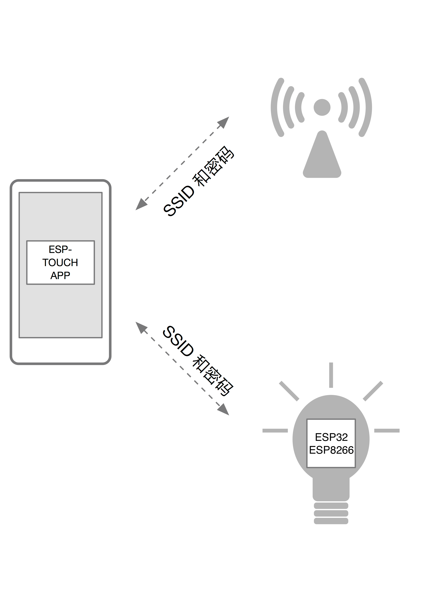

[[English]](esptouch-user-guide-en.md)

# ESP-TOUCH 用户指南

---

## 技术原理

乐鑫自主研发的 ESP-TOUCH 协议采⽤的是 Smart Config（智能配置）技术，帮助用户将采用 ESP8266 和 ESP32 的设备（以下简称“设备”）连接至 Wi-Fi 网络。用户只需在⼿机上进行简单操作即可实现智能配置。

由于设备一开始尚未联网，ESP-TOUCH 应用无法直接向设备发送信息。通过 ESP-TOUCH 通信协议，具有 Wi-Fi 网络接入能力的设备（例如智能手机）可以向 Wi-Fi 接入点 (AP) 发送一系列 UDP 数据包，其中每一包的长度（即 Length 字段）都按照 ESP- TOUCH 通信协议进⾏编码，SSID 和密码就包含在 Length 字段中，随后设备便能够接收这些 UDP 数据包，并从中解析出所需的信息。

数据包结构如下表所示：

| 字段    | 长度（字节）     | 描述                                |
|--------|----------------|-------------------------------------|
| DA     | 6              | 目标 MAC 地址                        |
| SA     | 6              | 源 MAC 地址                          |
| Length | 2              | 包含 SSID 和密钥                      |
| LLC    | 3              | 逻辑链路控制                          |
| SNAP   | 5              | 子网接入协议                          |
| DATA   | Variable       | 载荷                                 |
| FCS    | 4              | 帧校验序列                            |

## ESP-TOUCH 操作指南

### 功能概述

- **支持的平台**：  
  - ESP8266：OS SDK 和 NonOS SDK
  - ESP32：ESP-IDF
- **协议兼容性**：集成了微信 AirKiss 协议
- 用户可以通过 ESP-TOUCH 应用或微信客户端配置设备

### 操作流程

1. 准备一台支持 ESP-TOUCH 的设备，开启 Smart Config 功能。
2. 将手机连接至目标路由器。
3. 打开手机上的 ESP-TOUCH 应用。
4. 输入路由器的 SSID 和密码以将设备连接到路由器。如果路由器是开放网络（未加密），则密码字段可留空。

**重要注意事项**

- **距离影响**：设备与路由器距离越远，连接耗时越长
- **路由器状态**：配置前需确保路由器已启动
- **超时机制**：
  - 应用端超时未连接会返回配置失败信息
  - 设备端超时未获取信息会自动重启 Smart Config
  - 可通过 `esptouch_set_timeout(uint8 time_s)` 或 `esp_smartconfig_set_timeout(uint8 time_s)` 设置超时时间
- **工作模式**：
  - **ESP8266**：需启用 Sniffer 模式，禁用 Station/soft-AP 模式
  - **ESP32**：可同时启用 Sniffer 和 Station 模式
- **IP 交互**：配置完成后，手机端获取设备 IP，设备端返回手机 IP，支持自定义局域网通信
- **AP 隔离**：路由器启用 AP 隔离可能导致应用无法收到成功提示
- **多设备支持**：应用可同时配置多个设备接入同一路由器
- **网络限制**：不支持 5 GHz 频段和 802.11ac 协议

## 性能分析

ESP-TOUCH 的通信模型可以抽象为某种错误率的单向通道，但这种错误率又根据带宽的不同而有所不同。通常：

- 20 MHz 带宽下，数据包错误率约为 0–5%
- 40 MHz 带宽下，数据包错误率约为 0–17%

假设所需要传递信息的最大长度为 104 字节，在这种情况下，若不采用纠错算法，则难以保证在有限的传递次数内完成信息的发送。

### 累积纠错算法

为了解决这一问题，ESP-TOUCH 采用了累积纠错算法，以确保在有限的次数内完成信息发送。该算法的理论基础是：在多轮数据发送过程中，同一位数据出错的概率非常低。因此可以累积多轮数据传递结果进行分析，在某一轮中发生错误的数据位可能在其他轮中找到其对应的正确值，从而保证在有限的次数内完成信息的发送。

信息发送的成功率可以通过以下公式表示：

成功率 = [1 – (1 – P)k]l

其中：
- P：单个数据包的成功率
- k：发送轮次
- l：发送信息的长度（字节）

**典型场景分析**：
- **20 MHz 带宽** (*P = 0.95*)：104 字节数据成功率可达 95%
- **40 MHz 带宽** (*P = 0.83*)：72 字节数据成功率可达 83%

以下表格显示了采用累积纠错算法时，信息发送的成功率和发送时间的不同情况。

**表：20 MHz 带宽分析**

| 轮次 | 时间（秒） – 104 字节   | 成功率 – 104 字节   | 时间（秒） – 72 字节  | 成功率 – 72 字节  |
|------|----------------------|-------------------|---------------------|------------------|
| 1    | 4.68                 | 0.0048            | 3.24                | 0.0249           |
| 2    | 9.36                 | 0.771             | 6.48                | 0.835            |
| 3    | 14.04                | 0.987             | 9.72                | 0.991            |
| 4    | 18.72                | 0.9994            | 12.90               | 0.9996           |
| 5    | 23.40                | 0.99997           | 16.20               | 0.99998          |
| 6    | 28.08                | 0.999998          | 19.40               | 0.99999          |

**表：40 MHz 带宽分析**

| 轮次 | 时间（秒） – 104 字节   | 成功率 – 104 字节   | 时间（秒） – 72 字节  | 成功率 – 72 字节  |
|------|----------------------|-------------------|---------------------|------------------|
| 1    | 4.68                 | 3.84e-9           | 3.24                | 1.49e-6          |
| 2    | 9.36                 | 0.0474            | 6.48                | 0.121            |
| 3    | 14.04                | 0.599             | 9.72                | 0.701            |
| 4    | 18.72                | 0.917             | 12.90               | 0.942            |
| 5    | 23.40                | 0.985             | 16.20               | 0.989            |
| 6    | 28.08                | 0.997             | 19.40               | 0.998
