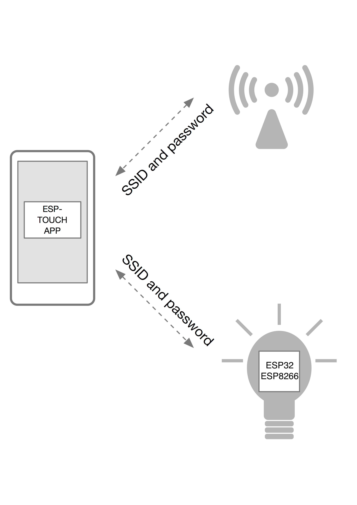

[[中文]](esptouch-user-guide-cn.md)

# ESP-TOUCH User Guide

---

## Technology Overview

Espressif’s ESP-TOUCH protocol implements the Smart Config technology to enable seamless Wi-Fi provisioning for ESP8266 and ESP32 embedded devices (hereafter "the device") through smartphone-based configuration.

Since the device is not connected to the network initially, the ESP-TOUCH application cannot send any information to the device directly. With the ESP-TOUCH communication protocol, a device with Wi-Fi access capabilities, such as a smartphone, can send a series of UDP packets to the Wi-Fi Access Point (AP), encoding the SSID and password into the Length field of each of these UDP packets. The device can then reach the UDP packets, obtaining and parsing out the required information.

The data packet structure is shown below:

| Field  | Length (Bytes) | Description                          |
|--------|----------------|--------------------------------------|
| DA     | 6              | Destination MAC Address              |
| SA     | 6              | Source MAC Address                   |
| Length | 2              | Encodes SSID and password            |
| LLC    | 3              | Logical Link Control                 |
| SNAP   | 5              | Subnetwork Access Protocol           |
| DATA   | Variable       | Payload                              |
| FCS    | 4              | Frame Check Sequence                 |

## ESP-TOUCH Operations

### Functional Overview

- **Supported Platforms**:  
  - ESP8266: OS SDK, NonOS SDK 
  - ESP32: ESP-IDF Framework
- **Protocol Compatibility**: Integrated with AirKiss protocol developed by WeChat.
- Devices can be configured using either the ESP-TOUCH app or the WeChat client.

### Operation Process

1. Prepare a device that supports ESP-TOUCH, and enable its Smart Config function.
2. Connect the smartphone to the target router.
3. Open the ESP-TOUCH App on the smartphone.
4. Input the router’s SSID and password to connect the device to the router. If the router is open (unencrypted), leave the password field blank.

**Important Notes**

- **Distance Impact**: If the device is far from the router, it may take longer to connect.
- **Router Status**: Ensure the router is powered on before configuration. 
- **Timeout Mechanism**:
  - The App returns a configuration failure message if connection isn't established within the timeout period.
  - The device automatically restarts Smart Config if credentials aren't obtained before timeout.
  - Adjust timeout duration using `esptouch_set_timeout(uint8 time_s)` or `esp_smartconfig_set_timeout(uint8 time_s)`.
- **Operational Modes**:
  - **ESP8266**: Sniffer mode must be enabled, with Station/soft-AP modes disabled.
  - **ESP32**: Sniffer and Station modes can be enabled at the same time.
- **IP Exchange**: After configuration, the smartphone obtains the device's IP address, while the device returns the smartphone's IP, enabling custom LAN communication.
- **AP Isolation**: If AP isolation is enabled on the router, the App might not receive the success notification.
- **Multi-Device Support**: The App can configure multiple devices to connect to the same router simultaneously.
- **Network Limitations**: 5 GHz frequency band and 802.11ac protocol are not supported.

## Performance Analysis

The ESP-TOUCH communication model can be understood as a unidirectional channel with a certain packet error rate. However, this error rate varies depending on the bandwidth. Typically:

- For 20 MHz bandwidth, the packet error rate is approximately 0–5%.
- For 40 MHz bandwidth, it ranges from 0–17%.

Assuming that the maximum length of data to be transmitted is 104 bytes, if no error-correcting algorithm is used, it is difficult to ensure that the data can be transmitted over limited rounds of data transfer.

### Cumulative Error-Correcting Algorithm

To address this, ESP-TOUCH implements a cumulative error-correcting algorithm to complete data transmission within a limited number of rounds. The theoretical basis of this algorithm is that the probability of an error occurring on the same bit of data during multiple rounds of data transmission is very low. Therefore, it is possible to accumulate results of multiple rounds of data transfer, where there is great potential for one bit of erroneous data in one round to lead to the correct corresponding value in other rounds, thus ensuring the completion of data transfer within a limited amount of time.

The success rate of data transmission can be generalized as:

\[ \text{Success Rate} = \left[1 - (1 - P)^k\right]^l \]

Where:
- \( P \): Single-packet success rate
- \( k \): Transmission rounds
- \( l \): Data length (in bytes)

**Typical Scenario Analysis**:
- **20 MHz Bandwidth** (\( P = 0.95 \)): 104-byte data achieves a 95% success rate.
- **40 MHz Bandwidth** (\( P = 0.83 \)): 72-byte data achieves an 83% success rate.

The tables below show the probability of the data transmission success rate and the transmission time when the cumulative error-correcting algorithm is adopted.

**Table: 20 MHz Bandwidth Analysis**

| Rounds | Time (s) – 104 Bytes | Success Rate – 104 Bytes  | Time (s) – 72 Bytes | Success Rate – 72 Bytes  |
|--------|----------------------|---------------------------|---------------------|--------------------------|
| 1      | 4.68                 | 0.0048                    | 3.24                | 0.0249                   |
| 2      | 9.36                 | 0.771                     | 6.48                | 0.835                    |
| 3      | 14.04                | 0.987                     | 9.72                | 0.991                    |
| 4      | 18.72                | 0.9994                    | 12.90               | 0.9996                   |
| 5      | 23.40                | 0.99997                   | 16.20               | 0.99998                  |
| 6      | 28.08                | 0.999998                  | 19.40               | 0.99999                  |

**Table: 40 MHz Bandwidth Analysis**

| Rounds | Time (s) – 104 Bytes | Success Rate – 104 Bytes  | Time (s) – 72 Bytes | Success Rate – 72 Bytes  |
|--------|----------------------|---------------------------|---------------------|--------------------------|
| 1      | 4.68                 | 3.84e-9                   | 3.24                | 1.49e-6                  |
| 2      | 9.36                 | 0.0474                    | 6.48                | 0.121                    |
| 3      | 14.04                | 0.599                     | 9.72                | 0.701                    |
| 4      | 18.72                | 0.917                     | 12.90               | 0.942                    |
| 5      | 23.40                | 0.985                     | 16.20               | 0.989                    |
| 6      | 28.08                | 0.997                     | 19.40               | 0.998                    |
